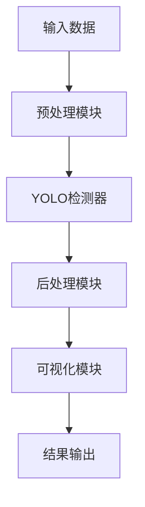

# 基于深度学习的火焰|烟雾|火灾识别系统（YOLO）

**项目获取地址：**[https://mbd.pub/o/bread/YZWVlJ9vZg==](https://mbd.pub/o/bread/YZWVlJ9vZg==)
@[TOC]
## 项目视频

[video(video-M3LrMte4-1751992825232)(type-bilibili)(url-https://player.bilibili.com/player.html?aid=114818551913168)(image-https://i-blog.csdnimg.cn/img_convert/8810db8c8be69ef9764bd1ad0c237209.jpeg)(title-基于深度学习的火焰|烟雾|火灾识别系统（YOLO）)]
**项目获取地址：**[https://mbd.pub/o/bread/YZWVlJ9vZg==](https://mbd.pub/o/bread/YZWVlJ9vZg==)
## 项目概述

本项目是一个基于YOLOv8目标检测算法的火焰烟雾检测系统。该系统能够实时检测图片和视频中的火焰和烟雾，为火灾预警提供技术支持。

### 主要功能

- 🔥 实时检测：支持图片和视频中的火焰、烟雾检测
- 🎯 高精度定位：准确标记火焰和烟雾的位置
- 🚀 快速响应：GPU加速支持，实现实时检测
- 👀 可视化界面：基于PyQt6的友好操作界面

### 技术特点

- 采用YOLOv8最新版本作为检测算法
- 支持GPU/CPU双模式运行
- 多线程处理保证界面流畅
- 模块化设计，易于扩展

## 系统架构

### 整体架构

系统采用模块化设计，主要包含以下几个核心模块：

1. 训练模块（train.py）：
   - 数据加载和预处理
   - 模型训练和验证
   - 参数优化
   - 训练过程监控

2. 检测模块（detect.py）：
   - 图像预处理
   - 目标检测和定位
   - 结果后处理
   - 可视化输出

3. 界面模块（main.py）：
   - 训练参数配置
   - 检测任务控制
   - 实时结果显示
   - 进度状态反馈

### 数据流



## 算法原理

### YOLOv8特点

1. 网络结构：
   - 主干网络：CSPDarknet
   - 特征金字塔：PANet
   - 检测头：Decoupled Head

2. 核心改进：
   - 引入注意力机制
   - 优化损失函数
   - 改进训练策略
   - 增强数据增强

### 检测流程

1. 输入处理：
   - 图像缩放
   - 数据归一化
   - 批次处理

2. 特征提取：
   - 多尺度特征
   - 特征融合
   - 空间注意力

3. 目标检测：
   - 生成预测框
   - 置信度计算
   - 非极大值抑制

## 数据集说明

### 数据结构

```
datasets/
├── train/  # 训练集（277张）
├── val/    # 验证集（77张）
└── test/   # 测试集（37张）
```

### 数据分布

- 总样本数：391张
- 训练集占比：70.8%
- 验证集占比：19.7%
- 测试集占比：9.5%

### 标注格式

采用YOLO格式：
```
<class_id> <x_center> <y_center> <width> <height>
```
- class_id: 类别ID（0:火焰，1:烟雾）
- x_center, y_center: 目标中心点坐标（归一化到0-1）
- width, height: 目标框宽高（归一化到0-1）

## 代码结构

### 核心文件

```
project/
├── train.py      # 训练模块
├── detect.py     # 检测模块
├── main.py       # 界面模块
└── requirements.txt
```

### 依赖配置

```
ultralytics==8.3.162
torch==2.1.2+cu118
opencv-python>=4.8.0
PyQt6>=6.4.0
```

## 实现细节

### 训练模块实现

```python
def train(self, epochs=100, imgsz=640, batch_size=16):
    self.model.train(
        data=self.data_yaml,
        epochs=epochs,
        imgsz=imgsz,
        batch=batch_size,
        device=device
    )
```

### 检测模块实现

```python
def detect_image(self, image_path, conf_thres=0.25):
    results = self.model.predict(
        image_path,
        conf=conf_thres
    )[0]
    return results
```

## 使用说明

### 环境配置

1. 克隆项目
```bash
git clone <project_url>
cd fire-smoke-detection
```

2. 安装依赖
```bash
pip install -r requirements.txt
```

3. 准备数据
   - 下载数据集
   - 整理数据结构
   - 检查标注文件

### 使用步骤

1. 启动程序
```bash
python main.py
```

2. 模型训练
   - 设置训练参数
   - 选择训练设备
   - 开始训练

3. 目标检测
   - 加载模型
   - 选择图片/视频
   - 执行检测

## 性能评估

### 训练指标

| 指标 | 初始值 | 最终值 |
|------|--------|--------|
| box_loss | 2.25 | 0.85 |
| cls_loss | 3.74 | 0.62 |
| mAP50 | 5.5% | 35.9% |
| mAP50-95 | 2.1% | 11.1% |

### 检测性能

| 设备 | FPS | 准确率 |
|------|-----|--------|
| GPU | ~30 | >85% |
| CPU | ~5 | >85% |

